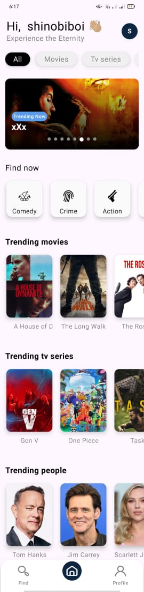
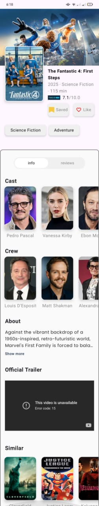
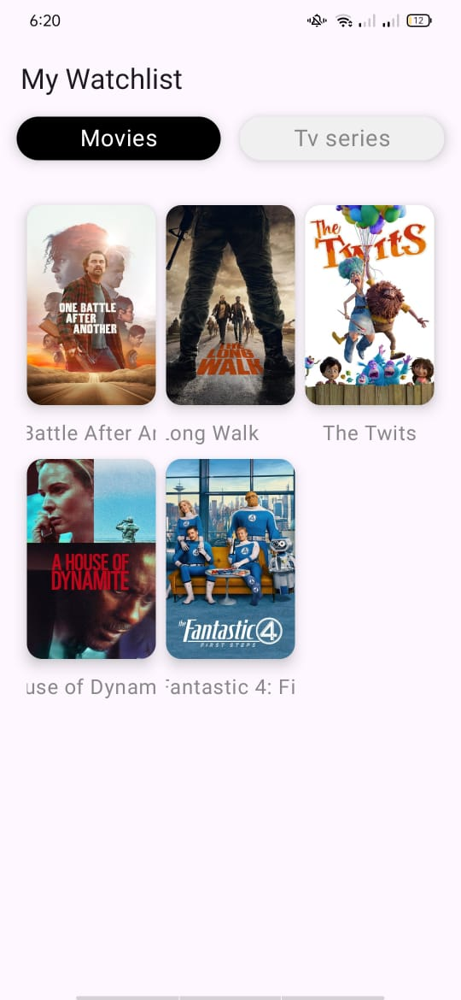

# 🎬 ShinobiHub  


---

## 🎥 Overview  

**ShinobiHub** is a modern Android app built using the **TMDB API**, designed to explore trending and popular movies and TV shows with a focus on **clean architecture**, **state-driven UI**, and **modern Android development practices**.  

It’s developed entirely with **Jetpack Compose** and follows the **MVI (Model–View–Intent)** pattern to ensure predictable state management and unidirectional data flow — combining elegant design with maintainable architecture.

---

## 🖼️ Screenshots  

| Home | Details | Watchlist |
|:----:|:--------:|:----------:|
|  |  |  |


## ✨ Features  

🎥 **Explore Movies & TV Shows**  
Browse trending, popular, and top-rated titles powered by the TMDB API.  

🔑 **TMDB Authentication**  
Secure login using TMDB request tokens to manage user sessions safely.  

🧠 **MVI Architecture**  
Predictable and testable UI powered by Actions, Results, and ViewStates.  

🎨 **Dynamic Themes**  
Automatic light/dark mode support with Material 3 dynamic color schemes.  

💾 **Persistent Session Management**  
Built with **DataStore** for secure, lightweight data persistence.  

⚡ **Reactive State Management**  
Smooth async flow using **Kotlin Coroutines** and **StateFlow**.  

🧩 **Dependency Injection**  
Modular and scalable design with **Dagger Hilt**.  

🧭 **Navigation Made Simple**  
Compose Navigation ensures type-safe and intuitive navigation.  

---

## 🛠 Tech Stack  

| Layer | Technologies |
|-------|---------------|
| **Language** | Kotlin |
| **UI** | Jetpack Compose + Material 3 |
| **Architecture** | MVI (Model–View–Intent) |
| **DI** | Dagger Hilt |
| **Persistence** | DataStore Preferences |
| **Async** | Coroutines + StateFlow |
| **Networking** | TMDB API |
| **Design** | Material You + Figma |
| **Build** | Gradle KTS (Kotlin DSL) |

---

## 🚀 Quick Start  

### Prerequisites  
✅ Android Studio **Giraffe (or newer)**  
✅ Android **5.0+ (API 21)**  
✅ A **TMDB API key** from [themoviedb.org](https://www.themoviedb.org/)  

### Installation  

1. Clone the repository:
   ```bash
   git clone https://github.com/ShinobiBoi/ShinobiHub.git
